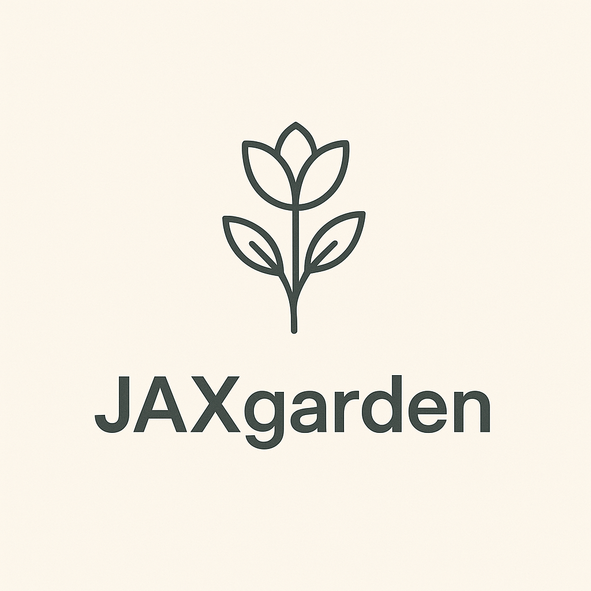

# JAXgarden

[](https://github.com/ml-gde/jax-layers/actions/workflows/docs.yml)
[](https://github.com/ml-gde/jax-layers/actions/workflows/tests.yml)



A reusable collection of high-performance neural network layers and models in JAX, aiming to match and exceed the capabilities available in the PyTorch ecosystem.

## Motivation

JAXgarden was created to provide the JAX ecosystem with a comprehensive library of well-documented, thoroughly tested, and numerically accurate implementations of neural network layers and models. The project aims to:

- Provide both functional APIs and Flax NNX wrappers for maximum flexibility
- Ensure seamless integration with the broader JAX ecosystem, especially Flax
- Facilitate easy upstreaming of implementations to core libraries
- Maintain rigorous testing and documentation standards
- Match or exceed the performance of equivalent PyTorch implementations

Initially started within the ML GDE group, the project began with a high-performance MultiHeadAttention implementation supporting various attention backends, with plans to expand to more layers and models.

## Features

- **MultiHeadAttention**: A Flax NNX-compatible implementation with support for different attention backends.
  - Supports JAX's native Flash Attention implementation through cuDNN
  - Seamlessly integrates with Flax NNX's module system
  - Provides a simple interface for switching between attention implementations

## Installation

```bash
# Install from source
git clone https://github.com/ml-gde/jax-layers.git
cd jax-layers
pip install -e .
```

## Usage

### LLaMA inference

```python
from jaxgarden import LlamaConfig, LlamaForCausalLM, Tokenizer
from flax import nnx


# HF repo id of the LLaMA variant that you want to use
model_id = "meta-llama/Llama-3.2-1B"

# initialize the LLaMA architecture
config = LlamaConfig()
model = LlamaForCausalLM(config, rngs=nnx.Rngs(0))

# This is a one-liner to download HF checkpoint from HuggingFace Hub,
# convert it to jaxgarden format,
# save it in an Orbax checkpoint,
# and then remove the HF checkpoint.
model.from_hf(model_id)

# this works just like `transformers.AutoTokenizer`,
# but without the dependency of the whole `transformers` library.
# Instead, we simply extend `tokenizers` package and add some cnvenience code for JAX.
tokenizer = Tokenizer.from_pretrained(model_id)

text = "The meaning of life is"
model_inputs = tokenizer.encode(text)
output = model.generate(**model_inputs, max_length=20, do_sample=True)
output_text = tokenizer.decode(output)
print(output_text)
```


### MultiHeadAttention Module (Flax NNX)

```python
import jax
import jax.numpy as jnp
import flax.nnx as nnx
from jaxgarden.attention import MultiHeadAttention

# Create a MultiHeadAttention module with Flash Attention support
attention = MultiHeadAttention(
    num_heads=8,
    in_features=512,
    implementation="cudnn",  # Use cuDNN's Flash Attention if available
    rngs=nnx.Rngs(0),
)

# Create input data
key = jax.random.PRNGKey(0)
x = jax.random.normal(key, (2, 128, 512))  # (batch, seq_length, hidden_dim)

# Create a causal attention mask
mask = jnp.tril(jnp.ones((2, 1, 128, 128)))  # (batch, 1, q_len, kv_len)

# Apply the model
output = attention(x, mask=mask)
```

### RoPEMultiHeadAttention Module (Flax NNX)

```python
import jax
import jax.numpy as jnp
import flax.linen as nn
from jaxgarden.attention.rope_multi_head_attention import RoPEMultiHeadAttention

# 1. Setup
key = jax.random.PRNGKey(0)
batch_size, seq_len = 2, 16
num_heads, head_dim = 4, 32
embed_dim = num_heads * head_dim
x = jnp.ones((batch_size, seq_len, embed_dim))

# 2. Instantiate Module
attention = RoPEMultiHeadAttention(num_heads=num_heads, head_dim=head_dim)

# 3. Initialize Parameters
params = attention.init(key, x)['params']

# 4. Apply Module (Forward Pass)
output = attention.apply({'params': params}, x)
```

### Mixture of Experts (Flax NNX)

```python
import jax
import jax.numpy as jnp
import flax.linen as nn
from jaxgarden.functional.MoE import MixtureOfExperts

# 1. Setup
batch_size = 4
input_dim = 10
num_experts = 3
expert_output_dim = 5
key = jax.random.PRNGKey(0)
dummy_input = jax.random.normal(key, (batch_size, input_dim))

# 2. Instantiate Module
moe_model = MixtureOfExperts(num_experts=num_experts, expert_output_dim=expert_output_dim)

# 3. Initialize the model parameters (weights and biases)
key, params_key = jax.random.split(key)
params = moe_model.init(params_key, dummy_input)['params']

print("Initialized MoE parameters:", jax.tree_util.tree_map(lambda x: x.shape, params))

# 4. Apply Module (Forward Pass)
output = moe_model.apply({'params': params}, dummy_input)

print("\nInput shape:", dummy_input.shape)
print("Output shape:", output.shape)
```


### Functional API

#### Dot Product Attention with Implementation Selection

```python
import jax
import jax.numpy as jnp
from jaxgarden.functional import dot_product_attention

# Create random query, key, value tensors
key = jax.random.PRNGKey(0)
query = jax.random.normal(key, (2, 128, 8, 64))  # (batch, seq_len, heads, head_dim)
key_tensor = jax.random.normal(key, (2, 128, 8, 64))
value = jax.random.normal(key, (2, 128, 8, 64))

# Create a causal attention mask
mask = jnp.tril(jnp.ones((2, 1, 128, 128)))  # (batch, 1, q_len, kv_len)

# Apply dot product attention with Flash Attention implementation
output = dot_product_attention(
    query=query,
    key=key_tensor,
    value=value,
    mask=mask,
    implementation="cudnn",  # Use cuDNN's Flash Attention implementation
)
```

## Development

### Setup

1. Please fork the repository to your account first.
2. Follow the instructions below.

```bash
# Clone the repository
git clone https://github.com/yourusername/jax-layers.git
cd jax-layers

# Install development dependencies
pip install -e ".[dev]"
```

### Pre-commit

This project uses pre-commit hooks to ensure code quality and consistency. Pre-commit automatically runs linting and formatting tools (such as ruff) before each commit, helping to catch issues early.

```bash
# Install Pre-commit Hooks
pre-commit install

# Run Pre-commit on All Files
pre-commit run --all-files
```

Every time you attempt to commit, pre-commit automatically runs the configured hooks (e.g., ruff). If any issues are detected, the commit will be blocked until they are resolved.

### Testing

The project maintains a comprehensive test suite to ensure correctness and numerical accuracy:

```bash
# Run all tests
pytest

# Run tests with coverage
pytest tests/ --cov=jaxgarden

# Run specific test file
pytest tests/test_multi_head_attention.py
```

### Code Quality

We maintain high code quality standards through automated checks:

```bash
# Run linting
ruff check .

# Run type checking
mypy jaxgarden

# Run tests
pytest
```

### Documentation

Documentation is automatically generated from docstrings:

```bash
# Build documentation
cd docs
make html
```

### Development Container (for Windows users)

Since JAX doesn't support CUDA on Windows natively, we provide a development container configuration:

1. Install [Docker Desktop](https://www.docker.com/products/docker-desktop/) with WSL 2 backend
2. Install [NVIDIA Container Toolkit](https://docs.nvidia.com/datacenter/cloud-native/container-toolkit/install-guide.html)
3. Install [Visual Studio Code](https://code.visualstudio.com/) with the [Remote - Containers](https://marketplace.visualstudio.com/items?itemName=ms-vscode-remote.remote-containers) extension
4. Open the project in VS Code
5. Click the green icon in the bottom-left corner and select "Reopen in Container"

The container provides:

- Python 3.10
- CUDA 12.4 with cuDNN 9
- JAX with CUDA support
- All dependencies from your pyproject.toml

See [.devcontainer/README.md](.devcontainer/README.md) for more details.

## Contributing

Contributions are more than welcome! Whether it's:

- Adding new layer implementations
- Improving documentation
- Adding tests
- Reporting bugs
- Suggesting improvements

Please feel free to open issues and pull requests.

## License

This project is licensed under the MIT License - see the [LICENSE](LICENSE) file for details.

## Acknowledgements

**Google AI Developer Programs team supported this work by providing Google Cloud Credit.**

- Thanks to the JAX and Flax teams for their excellent libraries.
- Special thanks to the ML GDE group for initiating this project.
